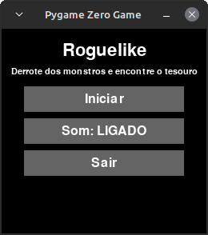
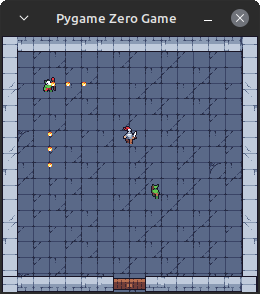
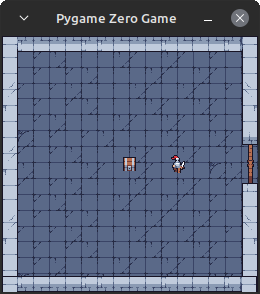
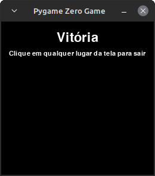
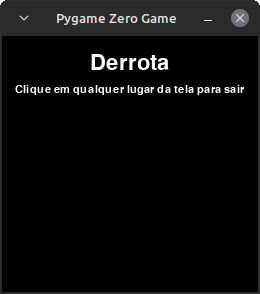

# Roguelike Pygame Zero

Este é um jogo roguelike desenvolvido como parte do teste prático da Kodland Brasil,
utilizando a biblioteca [Pygame Zero](https://pygame-zero.readthedocs.io/).

## 🚀 Como rodar

Siga os passos abaixo para executar o jogo localmente:

### 1. Crie um ambiente virtual (recomendado)

```sh
python3 -m venv .venv
source .venv/bin/activate
```

### 2. Instale as dependências

```sh
python3 -m pip install -r requirements.txt
```

### 3. Inicie o jogo

```sh
pgzrun main.py
```

## 📺 Imagens do jogo







## Assets

- Música: https://tallbeard.itch.io/music-loop-bundle
- Sprites: https://craftpix.net/freebies/free-top-down-roguelike-game-kit-pixel-art/
